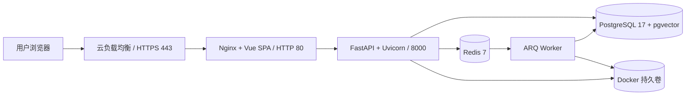

# FastAPI 云上部署操作手册

## 1. 文档目的

本文给出智能知识库平台在云服务器上的可执行部署流程。默认部署方式为：

- Ubuntu 24.04 LTS 云服务器；
- Docker Engine + Docker Compose；
- Web/Nginx、FastAPI、ARQ Worker、PostgreSQL/pgvector、Redis 同机运行；
- 云负载均衡终止 HTTPS，云服务器只接收负载均衡转发的 HTTP 流量；
- PostgreSQL、Redis 和 FastAPI 端口不直接暴露公网。

当前仓库的 `deploy/docker-compose.yml` 定位为单机部署。它可以用于演示、测试环境和
低并发首期上线，但不是多节点高可用方案。多副本生产环境还需要托管数据库、托管 Redis、
共享文件存储、镜像仓库、Secret 服务和容器编排平台。

## 2. 部署拓扑



FastAPI 负责认证、部门、知识库、检索、RAG 问答、模型配置和导出接口。文档解析、
Embedding 和耗时导出由 Worker 执行。FastAPI 镜像已经内置 Uvicorn，并监听
`0.0.0.0:8000`，部署时不需要在宿主机额外安装或手工启动 FastAPI。

## 3. 上线前准备

### 3.1 代码和版本

1. 目标 PR 已合并到 `main`。
2. GitHub CI 的 `quality` Job 全部通过。
3. 从 `main` 创建发布标签，例如 `v1.0.0`，不要直接部署未评审的功能分支。
4. 记录发布提交 SHA、镜像 SHA256 和上一个稳定版本标签。

### 3.2 云资源建议

单机部署建议从以下配置起步，并根据文档数量与并发压测调整：

| 资源 | 建议值 | 说明 |
|---|---:|---|
| CPU | 4 vCPU | API、Worker、数据库共享 |
| 内存 | 16 GiB | API、Worker、数据库与文档处理共享 |
| 系统盘 | 40 GiB | 系统、Docker 与镜像 |
| 数据盘 | 80 GiB 以上 | 数据库、上传文档、Markdown、导出与备份 |

仓库硬性最低磁盘要求为 20 GB，但不适合作为长期容量。上线前必须使用真实文档和并发
压测确认 API 与 Worker 的 CPU、内存和磁盘容量。

### 3.3 网络与安全组

推荐安全组规则：

| 方向 | 端口 | 来源/目标 | 用途 |
|---|---:|---|---|
| 入站 | 22 | 固定运维 IP | SSH |
| 入站 | 80 | 云负载均衡安全组 | Web/API 回源 |
| 入站 | 443 | 公网访问云负载均衡 | HTTPS |
| 出站 | 443 | 按企业策略放行 | GitHub、镜像、模型和大模型 API |

不要开放 `8000`、`5432`、`6379`。Docker 发布端口可能绕过部分主机防火墙规则，
因此必须同时使用云安全组限制来源。参考
[Docker 端口发布说明](https://docs.docker.com/engine/network/port-publishing/)。

云服务器必须能访问 Docker 镜像源以及实际使用的 DeepSeek、DashScope、Kimi 等模型接口。

## 4. 安装 Docker

以下命令以 Ubuntu 24.04 为例。Docker 官方同时支持 Ubuntu 22.04 和 24.04，生产环境
使用官方 APT 仓库，不使用便捷安装脚本。完整要求见
[Docker Engine Ubuntu 安装文档](https://docs.docker.com/engine/install/ubuntu/)。

```bash
sudo apt update
sudo apt install -y ca-certificates curl git openssl
sudo install -m 0755 -d /etc/apt/keyrings
sudo curl -fsSL https://download.docker.com/linux/ubuntu/gpg \
  -o /etc/apt/keyrings/docker.asc
sudo chmod a+r /etc/apt/keyrings/docker.asc

sudo tee /etc/apt/sources.list.d/docker.sources >/dev/null <<EOF
Types: deb
URIs: https://download.docker.com/linux/ubuntu
Suites: $(. /etc/os-release && echo "${UBUNTU_CODENAME:-$VERSION_CODENAME}")
Components: stable
Architectures: $(dpkg --print-architecture)
Signed-By: /etc/apt/keyrings/docker.asc
EOF

sudo apt update
sudo apt install -y docker-ce docker-ce-cli containerd.io \
  docker-buildx-plugin docker-compose-plugin
sudo systemctl enable --now docker
sudo usermod -aG docker "$USER"
```

重新登录 SSH 后验证：

```bash
docker version
docker compose version
docker run --rm hello-world
```

Docker 用户组拥有接近 root 的权限，云服务器应使用独立部署账号，不与普通业务账号共用。

## 5. 获取发布代码

```bash
sudo mkdir -p /opt/knowledge-base
sudo chown "$USER":"$USER" /opt/knowledge-base
git clone https://github.com/studynightfive/team_projects.git /opt/knowledge-base
cd /opt/knowledge-base
git fetch --tags --prune
git checkout v1.0.0
git status --short
git rev-parse HEAD
```

`git status --short` 必须没有输出。生产部署使用固定标签或提交，不使用会持续变化的分支头。

## 6. 配置生产环境变量

生产 Compose 读取的唯一文件是 `deploy/env/.env`，不是 `deploy/.env`。先创建权限受限的文件：

```bash
cd /opt/knowledge-base
umask 077
cp deploy/env/.env.example deploy/env/.env
chmod 600 deploy/env/.env
```

在安全终端分别生成随机值，四个密钥不能复用：

```bash
openssl rand -hex 24
openssl rand -hex 32
openssl rand -base64 32 | tr '+/' '-_'
openssl rand -hex 32
```

依次用于 PostgreSQL 密码、`SECRET_KEY`、`MODEL_KEY_FERNET_KEY` 和
`EXPORT_DOWNLOAD_SIGNING_KEY`。生成结果只写入云 Secret 服务或服务器 `.env`，不要发送到
聊天、工单、截图或日志。PostgreSQL 密码必须使用 URL-safe 字符，避免 `@:/?#[]`。

编辑 `deploy/env/.env`，至少确认以下配置：

```dotenv
POSTGRES_PASSWORD=<独立数据库密码>
SECRET_KEY=<至少32位随机值>
MODEL_KEY_FERNET_KEY=<Fernet格式独立密钥>
EXPORT_DOWNLOAD_SIGNING_KEY=<独立下载签名密钥>

APP_ENVIRONMENT=production
AUTO_SEED_DEMO_DATA=false
COOKIE_SECURE=true
DEBUG=false
APP_VERSION=1.0.0
APP_IMAGE_TAG=v1.0.0-<短提交SHA>

DEEPSEEK_API_KEY=<聊天模型API Key>
DEEPSEEK_BASE_URL=https://api.deepseek.com
DEEPSEEK_CHAT_MODEL=deepseek-chat

DASHSCOPE_API_KEY=<Embedding和Rerank API Key>
DASHSCOPE_BASE_URL=https://dashscope.aliyuncs.com/compatible-mode/v1
DASHSCOPE_RERANK_BASE_URL=https://dashscope.aliyuncs.com/compatible-api/v1
QWEN_EMBEDDING_MODEL=text-embedding-v2
QWEN_EMBEDDING_DIMENSIONS=1536
QWEN_RERANK_MODEL=qwen3-rerank

```

Embedding 维度必须与数据库向量字段一致。已经写入向量后切换 Embedding 模型或维度，必须
重新处理文档，不能在同一知识库混用不同维度。

配置完成后只验证语法，不输出展开后的配置：

```bash
docker compose --env-file deploy/env/.env \
  -f deploy/docker-compose.yml config --quiet
```

## 7. 构建发布镜像

仓库脚本会为 Web、API Server 和 Worker 构建版本、提交 SHA 和不可变组合标签：

```bash
cd /opt/knowledge-base
bash scripts/build-release.sh v1.0.0
git rev-parse --short HEAD
```

脚本输出的不可变标签格式为 `v1.0.0-<短提交SHA>`。将该值写入
`deploy/env/.env` 的 `APP_IMAGE_TAG`。正式环境不要长期使用 `local` 或可覆盖标签。

## 8. 启动服务与数据库迁移

```bash
cd /opt/knowledge-base
docker compose --env-file deploy/env/.env \
  -f deploy/docker-compose.yml up -d --no-build

docker compose --env-file deploy/env/.env \
  -f deploy/docker-compose.yml ps -a

docker compose --env-file deploy/env/.env \
  -f deploy/docker-compose.yml logs --tail=100 migrate
```

启动顺序为：PostgreSQL/Redis 健康 → `migrate` 执行 `alembic upgrade heads` →
FastAPI/Worker → Web。`kb-migrate` 正常状态是退出码 0；迁移失败时不能绕过迁移强行启动 API。

查看关键日志：

```bash
docker compose --env-file deploy/env/.env \
  -f deploy/docker-compose.yml logs -f --tail=200 api-server worker web
```

`/api/v1/health/ready` 会检查数据库、Redis 和文件存储；三项全部为 `ok` 后实例才可以
接收业务流量。

```bash
curl -i http://127.0.0.1/api/v1/health/live
curl -i http://127.0.0.1/api/v1/health/ready
bash scripts/health-check.sh
```

## 9. 配置域名与 HTTPS

推荐使用云厂商负载均衡和托管证书，不直接改容器内 Nginx：

1. 为域名申请托管 TLS 证书。
2. DNS 的 A/CNAME 记录指向负载均衡。
3. 创建 HTTPS 443 监听器并绑定证书。
4. 后端目标组转发到云服务器 `80` 端口。
5. HTTP 80 监听器统一重定向到 HTTPS 443。
6. 健康检查先使用 `/api/v1/health/live`；预热完成后可切换到
   `/api/v1/health/ready`。
7. 云服务器 80 端口只允许负载均衡安全组访问。

当前 Compose 的 Web 容器只直接提供 HTTP。没有云负载均衡时，必须另行部署完整 TLS 反向
代理与证书自动续期；不能在公网 HTTP 下把 `COOKIE_SECURE` 改成 `false` 冒充生产环境。

## 10. 创建首个生产管理员

应用只会幂等创建内建权限和角色，不会自动创建生产账号。Ready 检查通过后执行：

```bash
docker compose --env-file deploy/env/.env \
  -f deploy/docker-compose.yml exec api-server \
  /app/backend/.venv/bin/python scripts/bootstrap_admin.py
```

口令输入不回显，必须为 12–128 位。已有超级管理员时脚本会拒绝创建第二个首管理员。
生产环境禁止使用演示账号播种代替此流程。

## 11. 上线验收

使用真实域名验证：

| 项目 | 地址/操作 | 预期结果 |
|---|---|---|
| Web | `https://<域名>/` | 200，登录页正常 |
| Live | `/api/v1/health/live` | 200 |
| Ready | `/api/v1/health/ready` | 200，所有 checks 为 `ok` |
| Swagger | `/api/v1/docs` | 可访问或按安全策略限制 |
| Metrics | 公网 `/api/v1/metrics` | 404 |

业务验收按以下顺序执行：

1. 管理员登录并创建部门、部门管理员和普通用户。
2. 在模型管理中测试聊天、Embedding、Rerank 三类模型连接。
3. 创建知识库，上传医疗信息化文档并选择切分方法。
4. 等待文档状态变为处理完成，确认 Worker 没有失败日志。
5. 普通用户只能查看本部门和个人知识库。
6. AI 搜索能够生成综合答案，并显示去重后的引用来源。
7. 从答案导出 PDF、Word 和 Markdown，并在“我的下载”中再次下载。
8. 使用明确涉黄赌毒词条测试输入，确认前端即时禁用提交且后端直接调用返回 422。

## 12. 备份与定时任务

备份必须写到独立数据盘，并异地复制到对象存储：

```bash
sudo mkdir -p /mnt/kb-backups
sudo chown "$USER":"$USER" /mnt/kb-backups
cd /opt/knowledge-base
bash scripts/backup.sh /mnt/kb-backups
```

定时任务示例：

```cron
0 2 * * * cd /opt/knowledge-base && bash scripts/backup.sh /mnt/kb-backups
```

脚本会一致性备份 PostgreSQL 与文件卷并生成 SHA256 清单。仓库只保留最近 7 天文件，
长期周备份、月备份和跨区域复制由云备份系统负责。恢复流程见
[backup-restore.md](backup-restore.md)。

## 13. 升级和回滚

升级前先备份，然后检出新的发布标签并构建不可变镜像：

```bash
cd /opt/knowledge-base
bash scripts/backup.sh /mnt/kb-backups
git fetch --tags --prune
git checkout v1.0.1
bash scripts/build-release.sh v1.0.1
# 将 APP_IMAGE_TAG 更新为 v1.0.1-<短提交SHA>
docker compose --env-file deploy/env/.env \
  -f deploy/docker-compose.yml up -d --no-build
bash scripts/health-check.sh
```

应用回滚时把 `APP_IMAGE_TAG` 改回已验证的旧标签，再执行 `up -d --no-build`。旧镜像是否
兼容当前数据库 Schema 必须提前验证。只有迁移不兼容或数据损坏时才恢复数据库与文件卷；
恢复会丢失备份时间点之后的写入。详细流程见 [rollback.md](rollback.md)。

## 14. 常见故障

| 现象 | 检查项 | 处理原则 |
|---|---|---|
| Web 无法访问 | 安全组、负载均衡目标健康、80 端口占用 | 不公开 API/DB 端口 |
| `migrate` 失败 | `logs migrate`、数据库密码和数据盘 | 修复迁移，不绕过 |
| Ready 503 | Ready 响应中的 database/redis/storage | 按失败项排查 |
| 文档一直处理中 | Worker 日志、Redis、存储卷权限 | 不在 API 中改为同步处理 |
| RAG 无结果 | 文档状态、Embedding 维度、模型连通性 | 重新处理受影响文档 |
| 登录后立即失效 | HTTPS、`COOKIE_SECURE=true`、域名 | 不降级生产 Cookie |

排障时不得执行 `docker system prune -a`、删除 PostgreSQL 卷或删除存储卷。任何数据恢复
操作都必须先确认目标环境、备份批次和维护窗口。

## 15. 正式生产扩展边界

从单机扩展为高可用生产平台前，还必须完成：

- 将 PostgreSQL 迁移到启用 pgvector 的托管高可用实例；
- 将 Redis 迁移到支持持久化和故障转移的托管实例；
- 将上传、Markdown、assets 和导出迁移到共享文件系统或对象存储适配器；
- 将 Web、FastAPI、Worker 镜像推送到私有镜像仓库；
- 使用云 Secret 服务注入密钥，不再依赖服务器 `.env`；
- 为 API 和 Worker 分别扩容，FastAPI 每容器保持一个 Uvicorn Worker；
- 接入集中日志、Prometheus 指标、告警、WAF 和异地备份；
- 完成容量压测、故障演练、备份恢复演练和回滚演练。

相关文档：

- [单机部署指南](deployment.md)
- [发布检查清单](release-checklist.md)
- [备份与恢复](backup-restore.md)
- [回滚方案](rollback.md)
