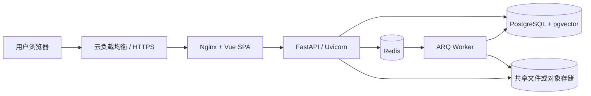

# 云上 FastAPI 部署说明

## 部署拓扑



FastAPI 负责认证、部门和知识库管理、检索、RAG 问答、模型配置与导出接口。文档解析、Embedding 和耗时导出继续交给独立 Worker，避免阻塞 API 请求。

## 云环境要求

- API 镜像：`deploy/docker/api-server.Dockerfile` 的 `runtime` 阶段。
- 启动命令：镜像内置 Uvicorn，监听 `0.0.0.0:8000`。
- 数据库：PostgreSQL 17，并启用 pgvector。
- 缓存与队列：Redis 7。
- 文件：单副本可使用持久卷；多副本必须使用共享文件系统或对象存储适配器。
- 网络：只公开 HTTPS 入口；FastAPI、PostgreSQL 和 Redis 不直接暴露公网。
- 输入安全模型：每个 API 副本建议至少 6 GiB 内存和 2 vCPU，挂载持久模型缓存；
  Uvicorn 每容器只运行一个 Worker，水平扩容通过增加容器副本完成。

## 上线顺序

1. 从云 Secret 服务注入数据库密码、应用签名密钥、模型密钥加密密钥和各模型 API Key。
2. 执行 `alembic -c migrations/alembic.ini upgrade heads`，成功后再启动 API 和 Worker。
3. 启动 FastAPI、Worker 和 Web 服务。
4. 检查 `/api/v1/health/live` 与 `/api/v1/health/ready`；只有
   `checks.llm_guard=ok` 后才把实例加入负载均衡。
5. 使用交互式 `backend/scripts/bootstrap_admin.py` 创建首个生产管理员。

## 必要安全配置

生产环境至少设置以下配置，具体值不写入文档或仓库：

```text
APP_ENVIRONMENT=production
AUTO_SEED_DEMO_DATA=false
DEBUG=false
COOKIE_SECURE=true
SECRET_KEY=<不少于 32 位的随机值>
MODEL_KEY_FERNET_KEY=<独立随机密钥>
EXPORT_DOWNLOAD_SIGNING_KEY=<独立随机密钥>
```

DeepSeek、Kimi、DashScope 或其他供应商的密钥优先通过管理中心加密保存；平台级默认模型也可由云 Secret 注入现有环境变量。

## 扩容注意事项

- FastAPI 可水平扩容，多副本共享 PostgreSQL、Redis 和文件存储。
- Worker 可独立扩容，但同一文档任务必须保持幂等。
- 切换 Embedding 模型后应安排文档重新处理任务，不混用不同模型生成的向量。
- 部门权限由后端查询实时校验，负载均衡层和前端隐藏菜单不能代替鉴权。
- 多副本可共享预填充的只读 Hugging Face 缓存，但每个进程仍会独立加载模型内存；
  扩容容量必须按副本计算，不能只按缓存文件大小估算。
